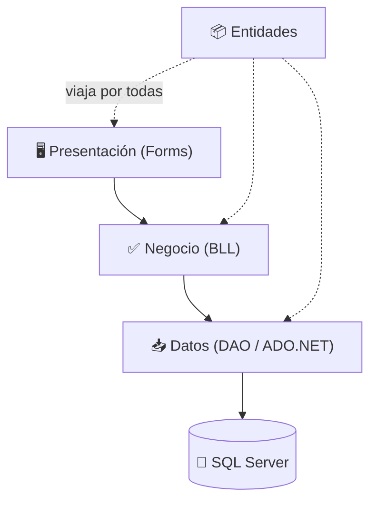

# Arquitectura multicapa

El sistema se divide en **4 capas**, cada una con **un solo trabajo**. Cada capa solo le habla a la
de **abajo**. Esto da orden, reutilización y fácil mantenimiento.

## Analogía del restaurante 🍽️
| Capa | Rol | Proyecto |
|---|---|---|
| 🖥️ Presentación | el **mozo** (atiende al usuario) | `Restaurant.Presentacion` |
| ✅ Negocio | el **jefe de cocina** (valida reglas) | `Restaurant.Negocio` |
| 📥 Datos | el **almacenero** (entra a la BD) | `Restaurant.Datos` |
| 📦 Entidades | las **cajas** que transportan datos | `Restaurant.Entidades` |
| 🏬 SQL Server | la **despensa** | `database/01_RestaurantDB.sql` |

## Diagrama

## Regla de oro
- El mozo **NO** entra a la despensa: Presentación nunca habla directo con la BD.
- Las **[[Capa de Entidades|Entidades]]** son la **caja que viaja** por todas las capas, no un paso de la secuencia.

## 🔗 Relaciones
- Capas: [[Capa de Presentación (Forms)]] → [[Capa de Negocio (BLL)]] → [[Capa de Datos (DAO)]]
- Las cajas que viajan: [[Capa de Entidades]]
- El destino final: [[Base de datos]]
- Verlo en acción: [[Flujo de datos]]
- Volver al [[Índice]]
