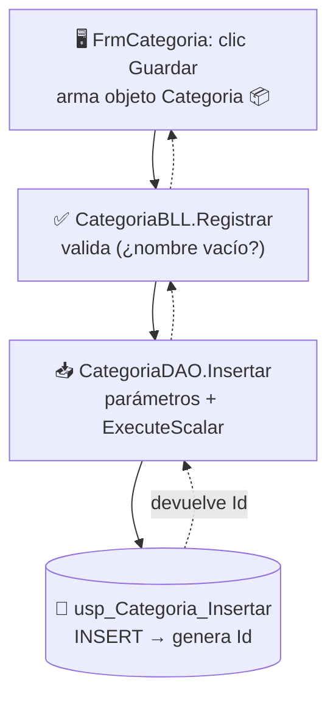

# Flujo de datos

El **viaje completo** de un dato a través de la [[Arquitectura multicapa]].

## 🟢 BAJADA — guardar "Bebidas" (escribir)


## 🔵 SUBIDA — mostrar la lista (leer)
Los datos **cambian de forma** en cada capa:

| Capa | Forma del dato |
|---|---|
| 🏬 SQL Server | **filas** en la tabla |
| 📥 Datos | `SqlDataAdapter` → **`DataTable`** 📋 (o `List<T>` 📦 con `SqlDataReader`) |
| ✅ Negocio | el mismo `DataTable` (puede filtrarlo con [[LINQ y lambdas|LINQ]]) |
| 🖥️ Presentación | `dgvLista.DataSource = ...` → **píxeles** en la grilla 👀 |

> Frase clave: **salen como filas de SQL, se vuelven `DataTable` en memoria, terminan como
> píxeles en la grilla.**

## La pieza mágica: `DataSource`
```csharp
dgvLista.DataSource = _bll.ListarTabla();   // el DataGridView se dibuja solo
```

## 🔗 Relaciones
- Recorre: [[Arquitectura multicapa]] → [[Capa de Presentación (Forms)]] → [[Capa de Negocio (BLL)]] → [[Capa de Datos (DAO)]] → [[Base de datos]]
- Formas del dato: [[ADO.NET conectado y desconectado]]
- Volver al [[Índice]]
