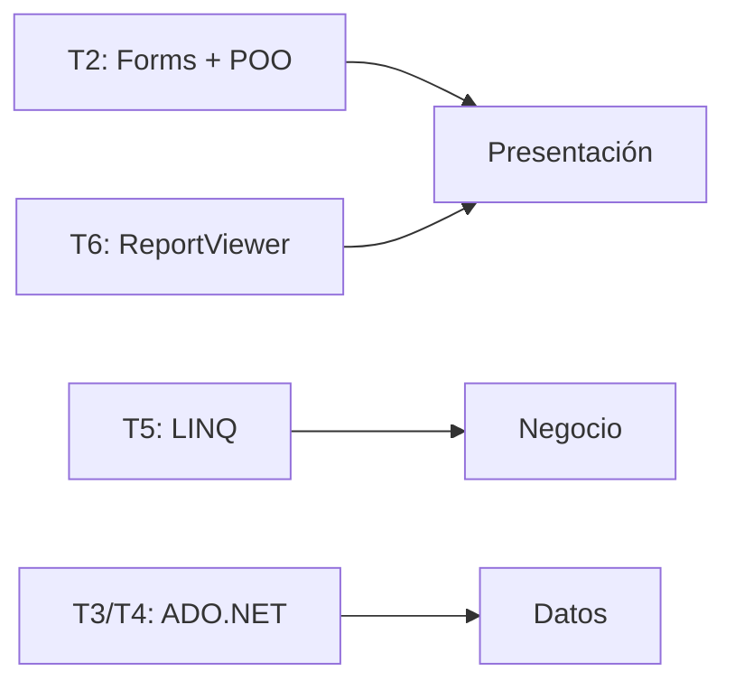

# Temas del curso (T1–T6)

Mapa de los temas de **Desarrollo de Sistemas Empresariales (5402)** y dónde se aplican en el proyecto.

| Tema | Contenido | En el proyecto |
|---|---|---|
| **T1** | Scrum (metodología ágil) | Gestión del proyecto (informe) |
| **T2** | .NET, Windows Forms, POO | [[Capa de Presentación (Forms)]] · [[Capa de Entidades]] · [[POO - Clase y Objeto]] |
| **T3** | ADO.NET conectado (SP, parámetros, transacción) | [[Capa de Datos (DAO)]] · [[Procedimientos almacenados]] · [[Parámetros e inyección SQL]] · [[Transacción (Commit y Rollback)]] |
| **T4** | ADO.NET desconectado (DataSet/DataTable/DataView) | [[ADO.NET conectado y desconectado]] · `ListarTabla()` · `FrmFacturacion` (DataView) |
| **T5** | LINQ y expresiones lambda | [[LINQ y lambdas]] · [[Capa de Negocio (BLL)]] |
| **T6** | Reportes ReportViewer / RDLC | `FrmReporteVentas` + `ReporteVentas.rdlc` |

## Resumen de una línea por capa

## 🔗 Relaciones
- Visión general: [[Arquitectura multicapa]]
- Volver al [[Índice]]
